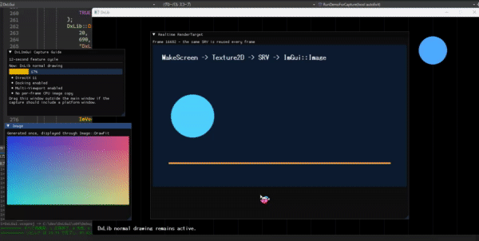

# DxLImGui

## 概要

DxLImGuiは、Windows上の[DxLib](https://dxlib.xsrv.jp/)と
[Dear ImGui](https://github.com/ocornut/imgui)のDirectX 11バックエンドを
つなぐC++17ライブラリです。

最初は`Initialize`、`BeginFrame`、`EndFrame`だけで動作確認でき、
必要に応じて`Image`、`RenderTarget`、`Advanced` APIへ進めます。

> [!IMPORTANT]
> DxLImGuiはDirectX 11専用です。`DxLib_Init()`より前に
> `DxLib::SetUseDirect3DVersion(DX_DIRECT3D_11)`を呼んでください。

> [!NOTE]
> DxLImGuiは現在初期開発段階です。
> v1.0.0までは、公開API、名前空間、挙動、ファイル構成が
> 変更される可能性があります


## デモGIF



## 特徴

- Windows / DirectX 11向け
- DxLibのウィンドウとD3D11デバイスをDear ImGuiバックエンドへ接続
- Keyboard Navigation、Docking、Multi-Viewportを設定可能
- `Image`による画像ファイルのRAII管理
- `RenderTarget`による`DxLib::MakeScreen()`のリアルタイム表示
- GraphHandleからSRVを登録時に一度だけ作成
- RenderTargetでは毎フレームのCPU画像転送やSRV再生成を行わない
- `DrawFit`はアスペクト比を維持して拡大・縮小
- 生のGraphHandleを管理したい場合の`Advanced` API

APIの目安は次のとおりです。

| レベル | 主なAPI | 用途 |
|---|---|---|
| Simple | `Initialize`、`BeginFrame`、`EndFrame` | 最初の動作確認 |
| Object | `Image`、`RenderTarget` | 通常の画像・描画先管理 |
| Advanced | `DxLImGui::Advanced` | 生のGraphHandleやプラットフォームウィンドウの手動制御 |

通常はSimple APIとObject APIだけで十分です。

## 必要なもの

- Windows x64環境
- Visual Studio 2022
- Visual Studio Installerの「C++によるデスクトップ開発」ワークロード
- Windows SDK
- C++17に対応したコンパイラ
- Git（リポジトリをcloneする場合のみ）

動作確認用のDxLibとDear ImGuiはリポジトリに同梱しています。
サンプルを動かすだけであれば、別途ダウンロードする必要はありません。


## 対応環境

### 確認済み

| 項目 | 確認内容 |
|---|---|
| OS | Windows x64 |
| Graphics API | DirectX 11 |
| 言語 | C++17 |
| Compiler | Visual Studio 2022 / MSVC 19.44 / v143 |
| 構成 | Debug x64、Release x64 |
| 同梱DxLib | 3.24f |
| 同梱Dear ImGui | 1.92.6 WIP |

### 未検証

- Win32/x86、ARM64
- clang-cl、MinGW、Visual Studio以外のビルド環境
- DirectX 9、DirectX 12、OpenGL、Vulkan
- Windows以外のOS
- 複数GPUやデバイスロスト後の自動復旧
- 複数モニター間でDPIが異なるMulti-Viewport運用

未検証環境を「非対応」と断定するものではありません。ただし、現在の実装は
Windows API、DxLib、D3D11、Dear ImGuiのWin32/DX11バックエンドへ直接依存します。

## リポジトリ構成

| パス | 内容 |
|---|---|
| `include/DxLImGui/` | 利用側からインクルードする公開ヘッダ |
| `src/` | DxLImGui本体の実装 |
| `examples/` | サンプルと統合ランチャー |
| `tests/` | 回帰・安全性チェック |
| `thirdparty/DxLib/` | DxLibのヘッダと静的ライブラリ |
| `thirdparty/imgui/` | Dear ImGui本体と利用バックエンド |
| `docs/` | 補足資料と画像 |
| `build/` | ビルド時に生成される出力先（Git対象外） |

## 導入方法

このリポジトリのサンプルプロジェクトにはDxLibと、DxLImGuiが使用する
Dear ImGui本体、Win32バックエンド、DirectX 11バックエンドを最小構成で
同梱しています。Dear ImGui公式examples、FreeType連携、追加フォント、
他レンダラーバックエンドは同梱していません。

1. Visual Studio 2022で`DxLImGui.sln`を開きます。
2. `x64`と`Debug`または`Release`を選択します。
3. ソリューションをビルドします。
4. 引数なしで起動するとBasicサンプルが動きます。

### Zedで開発される方へ

リポジトリのルートをZedで開くと、clangdによるC++17の補完が有効になります。
VS2022、Visual Studio Installerの「C++によるデスクトップ開発」ワークロード、
Windows SDKをインストールしたうえで、コマンドパレットの
`task: spawn`から次のタスクを実行できます。

- `MSVC: Build Debug x64`
- `MSVC: Build Release x64`
- `MSVC: Clean Debug x64`
- `Run Debug x64`

ビルドタスクはVS2022付属の`vswhere`でMSBuildとv143 C++ツールセットを
自動検出するため、Developer Command PromptからZedを起動する必要はありません。
補完に使用するclangdは、システムにない場合はZedが自動的に用意します。

自分のプロジェクトへ組み込む場合は、少なくとも次を追加します。

- `include/DxLImGui/DxLImGui.h`
- `include/DxLImGui/DxLImGuiConfig.h`
- `src/DxLImGui.cpp`
- Dear ImGui本体
  - `imgui.cpp`
  - `imgui_draw.cpp`
  - `imgui_tables.cpp`
  - `imgui_widgets.cpp`
- Dear ImGuiバックエンド
  - `imgui_impl_win32.cpp`
  - `imgui_impl_dx11.cpp`
- DxLibのインクルードパス、ライブラリパス、利用構成に合う`.lib`

インクルードパスには`include`、DxLib、Dear ImGui本体、`backends`を追加してください。
ランタイムライブラリ（`/MT`、`/MTd`など）とDxLibのライブラリ種類も一致させます。

新規コードでは`#include <DxLImGui/DxLImGui.h>`を使用してください。
公開ヘッダの実体は`include/DxLImGui/DxLImGui.h`です。

## Quick Start

次は[examples/BasicExample.cpp](examples/BasicExample.cpp)と同じ初期化順を使う、
単独でビルド可能な最小例です。

```cpp
#include <DxLImGui/DxLImGui.h>

#include "DxLib.h"
#include "imgui.h"

namespace
{
    LRESULT CALLBACK HookWindowProc(
        HWND windowHandle,
        UINT message,
        WPARAM wParam,
        LPARAM lParam
    )
    {
        return DxLImGui::WndProcHandler(
            windowHandle,
            message,
            wParam,
            lParam
        );
    }
}

int WINAPI WinMain(HINSTANCE, HINSTANCE, LPSTR, int)
{
    DxLib::SetGraphMode(960, 540, 32);
    DxLib::ChangeWindowMode(TRUE);
    DxLib::SetUseDirect3DVersion(DX_DIRECT3D_11);
    DxLib::SetHookWinProc(HookWindowProc);

    // 必ずDxLib_Init()より前に呼びます。
    DxLImGui::ConfigureEnableDpiAwareness();
    DxLImGui::SetupBeforeDxLibInit();

    if (DxLib::DxLib_Init() == -1)
    {
        return 1;
    }

    DxLib::SetDrawScreen(DX_SCREEN_BACK);

    DxLImGui::DxLImGuiConfig config;
    config.ViewportsEnable = false;

    if (!DxLImGui::Initialize(config))
    {
        DxLib::DxLib_End();
        return 1;
    }

    while (DxLib::ProcessMessage() == 0)
    {
        DxLib::ClearDrawScreen();

        DxLib::DrawString(
            20,
            20,
            "DxLib is rendering.",
            DxLib::GetColor(255, 255, 255)
        );

        DxLImGui::BeginFrame();

        ImGui::Begin("Hello");
        ImGui::TextUnformatted("Dear ImGui is rendering.");
        ImGui::End();

        DxLImGui::EndFrame();
        DxLib::ScreenFlip();
    }

    // DxLib_End()より前に呼びます。
    DxLImGui::Shutdown();
    DxLib::DxLib_End();
    return 0;
}
```

重要な順番は次の3点です。

1. `ConfigureEnableDpiAwareness()`と`SetupBeforeDxLibInit()`は
   `DxLib_Init()`より前
2. 各フレームは`BeginFrame()`から`EndFrame()`まで
3. `Shutdown()`は`DxLib_End()`より前

## Image

`Image`は画像のGraphHandleとImGui表示用登録をまとめて管理します。
コピーはできませんが、moveできます。

```cpp
DxLImGui::Image image("assets/sample.png");

while (DxLib::ProcessMessage() == 0)
{
    DxLib::ClearDrawScreen();
    DxLImGui::BeginFrame();

    ImGui::Begin("Image");

    if (image)
    {
        image.DrawFit(ImGui::GetContentRegionAvail());
    }

    ImGui::End();
    DxLImGui::EndFrame();
    DxLib::ScreenFlip();
}

image.Reset(); // Shutdownより前を推奨
```

`Image::Load()`は最初にDxLibのGraphHandleが持つTexture2Dから直接SRVを作ります。
直接SRVを作れない場合だけ、既存のSoftImage経路へフォールバックします。
PNGのアルファを含む確認は既存テストに含まれます。

外部画像なしで実行できる完全な例は
[examples/ImageExample.cpp](examples/ImageExample.cpp)です。起動時に確認用PNGを
一度だけ生成し、`Image`へ読み込んだ後で一時ファイルを削除します。

## RenderTarget

`RenderTarget`は`DxLib::MakeScreen()`で作った描画先を所有し、その内容を
Dear ImGui内へ表示します。

```cpp
DxLImGui::RenderTarget gameView(640, 360);

while (DxLib::ProcessMessage() == 0)
{
    if (gameView.BeginDraw())
    {
        DxLib::ClearDrawScreen();
        DxLib::DrawCircle(
            100,
            100,
            40,
            DxLib::GetColor(255, 255, 255),
            TRUE
        );
        gameView.EndDraw();
    }

    DxLib::ClearDrawScreen();
    DxLImGui::BeginFrame();

    ImGui::Begin("Game View");
    gameView.DrawFit(ImGui::GetContentRegionAvail());
    ImGui::End();

    DxLImGui::EndFrame();
    DxLib::ScreenFlip();
}

gameView.Reset(); // Shutdownより前を推奨
```

内部ではMakeScreenのTexture2DをSRV経由で参照します。SRVは登録時に一度だけ
作成され、毎フレームは同じSRVを`ImGui::Image`へ渡します。
毎フレームのGPUからCPUへの画像転送、SoftImage変換、SRV再生成は行いません。

`BeginDraw()`は現在のDxLib描画先を保存します。そのため次のようなネストも可能です。

```cpp
if (outer.BeginDraw())
{
    // outerへ描画

    if (inner.BeginDraw())
    {
        // innerへ描画
        inner.EndDraw(); // outerへ復元
    }

    outer.EndDraw(); // 元の描画先へ復元
}
```

## Advanced API

> [!WARNING]
> Advanced APIは通常利用では不要です。`Image`または`RenderTarget`が
> 所有しているGraphHandleを重ねて登録しないでください。

生のGraphHandleを表示する場合は、呼び出し側がGraphHandleを所有します。

```cpp
const int graphHandle =
    DxLib::MakeScreen(480, 270, TRUE);

const bool registered =
    DxLImGui::Advanced::RegisterImage(graphHandle);

// ImGuiフレーム内
if (registered)
{
    DxLImGui::DrawImage(
        graphHandle,
        ImVec2(480.0f, 270.0f)
    );
}

// 終了時は必ずこの順番
DxLImGui::Advanced::UnregisterImage(graphHandle);
DxLib::DeleteGraph(graphHandle);
```

`Advanced`には次のAPIがあります。

- `RegisterImage`
- `UnregisterImage`
- `ClearImageCache`
- `UpdatePlatformWindows`
- `RenderPlatformWindows`
- `RestoreDxLibRenderingState`

現在の`EndFrame()`は、Multi-Viewportが有効ならプラットフォームウィンドウの
更新・描画も行います。そのため、通常のフレームループから
`UpdatePlatformWindows()`や`RenderPlatformWindows()`を追加で呼ぶ必要はありません。

## リソース寿命

### Image / RenderTarget

1. `Image`または`RenderTarget`がGraphHandleを所有
2. GraphHandleに対応するTexture2DはDxLibが所有
3. DxLImGuiの画像キャッシュはSRVを`ComPtr`で所有
4. `Reset()`でSRV登録を解除
5. SRV解放後に`DxLib::DeleteGraph()`を実行

フレーム中の`ImGui::Image`はSRVのポインタを参照しています。そのためフレーム中に
`Reset()`された場合、SRVと所有GraphHandleの破棄は`EndFrame()`まで遅延されます。
`EndFrame()`ではSRVを先に解放し、その後GraphHandleを削除します。

推奨終了順は次のとおりです。

```cpp
image.Reset();
renderTarget.Reset();

DxLImGui::Shutdown();
DxLib::DxLib_End();
```

デストラクタでも解放されますが、`Image`と`RenderTarget`は可能なら
`Shutdown()`より前に破棄してください。`Shutdown()`は必ず`DxLib_End()`より前です。

### Advanced

Advanced登録はGraphHandleを所有しません。生のGraphHandleを削除する前に、
対応するSRV登録を解除してください。

```text
UnregisterImage
    ↓
SRVを解放
    ↓
DxLib::DeleteGraph
```

## サンプル

| ファイル | 内容 | 統合ランチャーの引数 |
|---|---|---|
| [BasicExample.cpp](examples/BasicExample.cpp) | 最小初期化とフレームループ | `--basic-example` |
| [ImageExample.cpp](examples/ImageExample.cpp) | 外部アセット不要のImage表示 | `--image-example` |
| [RenderTargetExample.cpp](examples/RenderTargetExample.cpp) | MakeScreenのリアルタイム表示 | `--render-target-example` |
| [AdvancedExample.cpp](examples/AdvancedExample.cpp) | 生GraphHandleの登録と解放順 | `--advanced-example` |
| [DemoForCapture.cpp](examples/DemoForCapture.cpp) | 1280x720のGIF撮影用デモ | `--capture-demo` |

> [!IMPORTANT]
> `DxLImGui.vcxproj`は、各Exampleを別々の`.exe`として出力しません。
> 5つのExampleを1つの`DxLImGui.exe`へ組み込み、`examples/ExampleLauncher.cpp`がコマンドライン引数から
> 実行するExampleを選びます。引数なしで起動した場合は`BasicExample`だけが
> 実行されます。そのため、たとえば`ImageExample.cpp`を編集してビルドしても、
> 引数なしで起動すると変更箇所は表示されません。

編集したExampleは、対応する引数を付けて起動してください。

```powershell
.\build\x64\Debug\DxLImGui.exe --basic-example
.\build\x64\Debug\DxLImGui.exe --image-example
.\build\x64\Debug\DxLImGui.exe --render-target-example
.\build\x64\Debug\DxLImGui.exe --advanced-example
.\build\x64\Debug\DxLImGui.exe --capture-demo
```

Visual Studioから起動する場合は、次のように設定します。

1. `DxLImGui`プロジェクトのプロパティを開く
2. `構成プロパティ` → `デバッグ`を開く
3. `コマンド引数`へ、表にある引数を1つ設定する
4. 必要なら`作業ディレクトリ`を`$(ProjectDir)`にする
5. 編集した構成（Debug/Release、x64）をビルドしてから実行する

Debugをビルドした場合は`build\x64\Debug\DxLImGui.exe`、Releaseをビルドした場合は
`build\x64\Release\DxLImGui.exe`を起動します。異なる構成の古い実行ファイルを起動すると、
変更が反映されていないように見えるため注意してください。

各サンプル`.cpp`は単独ビルド時には自身の`WinMain`を提供します。統合プロジェクトでは
5つを同時にコンパイルするため、`DXLIMGUI_EXAMPLES_COMBINED_BUILD`を各Exampleへ
定義し、`examples/ExampleLauncher.cpp`だけが`WinMain`を提供します。通常サンプルは`tests/`の
ヘッダへ依存しません。

`--auto-exit`を追加すると240フレームで自動終了します。

```powershell
.\build\x64\Debug\DxLImGui.exe --image-example --auto-exit
```

## テスト

### ビルド

Visual Studioの開発者コマンドプロンプトから実行します。

```powershell
msbuild DxLImGui.sln /m /p:Configuration=Debug /p:Platform=x64
msbuild DxLImGui.sln /m /p:Configuration=Release /p:Platform=x64
```

### 非描画の安全性チェック

```powershell
.\build\x64\Debug\DxLImGui.exe --run-safety-checks
```

### MakeScreen直接SRVチェック

```powershell
.\build\x64\Debug\DxLImGui.exe --run-makescreen-srv-check --auto-exit
```

512x512のMakeScreenからTexture2Dを取得し、SRVを一度だけ作成します。
240フレーム同じSRVを使用し、`RefreshDxLibDirect3DSetting()`後も更新されることを
確認します。

### RenderTarget回帰チェック

```powershell
.\build\x64\Debug\DxLImGui.exe --run-render-target-checks --auto-exit
```

次を含む回帰確認です。

- GraphHandle直接SRV登録
- Image / RenderTargetのmove
- 二重`BeginDraw` / `EndDraw`
- 複数・ネストしたRenderTarget
- フレーム中Resetと遅延破棄
- 重複した画像登録の拒否
- PNGアルファ
- `DrawFit`による表示
- Shutdown時のSRV解放

詳細は[tests/README.md](tests/README.md)を参照してください。

READMEのQuick StartはBasicサンプルと同じ公開API・初期化順を使用し、
サンプル5本はDebug/Releaseプロジェクトのコンパイル対象に含めています。

## 既知の制限

- DirectX 11以外のレンダラーバックエンドはありません。
- RenderTargetの直接SRV作成に失敗した場合の
  `CopyResource` / `ResolveSubresource`フォールバックはありません。
- `Image`にはSoftImageフォールバックがありますが、RenderTargetにはありません。
- DxLibまたはD3D11デバイス再初期化後のSRV自動再生成はありません。
  `Image`と`RenderTarget`を作り直してください。
- `ClearImageCache()`や所有オブジェクトへの`UnregisterImage()`は、
  生存中の`Image` / `RenderTarget`の表示登録を無効にします。通常コードでは
  呼ばないでください。
- APIはスレッドセーフ用途を想定していません。
- 画像パスの公開APIは`const char*`です。
- Multi-Viewportは基本動作のみ確認しており、複数モニター・異種DPI環境は未検証です。
- 描画先の復元に失敗したRenderTargetは、安全のためGraphHandleを削除しません。

## ライセンス

DxLImGui本体はMIT Licenseで公開しています。
ライセンス原文と著作権表示は[LICENSE](LICENSE)を参照してください。

商用・非商用を問わず、利用、改変、複製、再配布が可能です。
再配布する場合は、DxLImGuiの著作権表示とMIT Licenseの許諾表示を、
ソフトウェアの複製または重要な部分に含めてください。

例えば、次の方法でライセンス表示を残せます。

- DxLImGuiの`LICENSE`ファイルを配布物へ同梱する
- 配布物のライセンス一覧へ、著作権表示とMIT License全文を掲載する
- ライセンス表示を削除せず、ソースコードを再配布する

改変版を公開することも可能です。
その際は、元のDxLImGui全体を自分が作成したと誤解させる表示は避けてください。

この説明は、MIT Licenseを初めて利用する方向けの要約です。
正式な条件は[LICENSE](LICENSE)の原文が優先されます。

### 第三者ソフトウェアと素材

DxLImGui本体のMIT Licenseは、`thirdparty/`、Dear ImGui、
画像、フォント、GIFなどには適用されません。

第三者ソフトウェアの著作権表示とライセンスについては、
[THIRD_PARTY_NOTICES.md](THIRD_PARTY_NOTICES.md)を参照してください。

- DxLibの付属文書:
  [thirdparty/DxLib/DxLib.txt](thirdparty/DxLib/DxLib.txt)
- Dear ImGuiのMIT License:
  [thirdparty/imgui/LICENSE.txt](thirdparty/imgui/LICENSE.txt)
- Dear ImGui同梱フォントのクレジット:
  [thirdparty/imgui/docs/FONTS.md](thirdparty/imgui/docs/FONTS.md#creditslicenses-for-fonts-included-in-repository)


## 謝辞

- DxLibの作者 `山田 巧`様
- Dear ImGuiの作者`Omar Cornut`氏とコントリビューターのみなさま

両プロジェクトが提供する機能とドキュメントの上にDxLImGuiは構築されています。

素敵なライブラリをありがとうございます。
